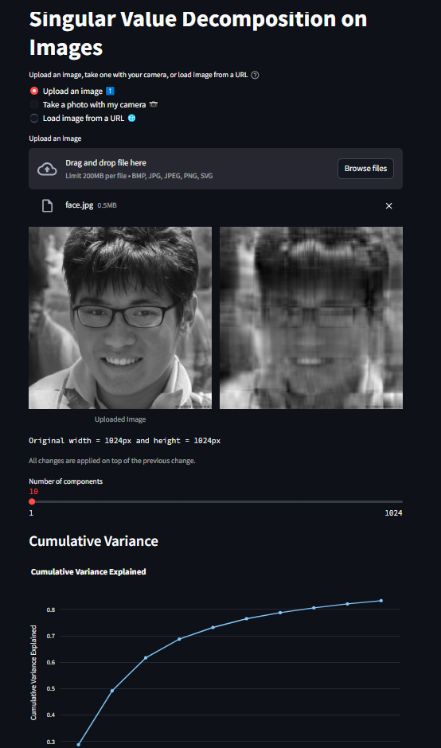

# Singular Value Decomposition interactive Streamlit App

Leveraging the power of ChatGPT and drawing inspiration from *Siddhant Sadangi's* [repository](https://github.com/SiddhantSadangi/ImageWorkdesk), I've developed a user-friendly Streamlit application. This app empowers users to effortlessly perform Singular Value Decomposition (SVD) on an image of their preference.

The streamlined interface allows you to choose an image through various means—whether it's uploading from your device, capturing a new photo using your camera, or even loading an image directly from a URL. Once your image is loaded, you can adjust the number of components for the SVD, visualizing the impact on the reconstructed image in real-time.

The intuitive layout displays the original and reconstructed images side by side, providing a clear comparison. Additionally, a dynamic slider allows you to control the number of components, offering a hands-on experience in understanding the trade-off between information preservation and data reduction.

To enhance the user experience, the app incorporates Plotly Express for generating an interactive cumulative variance plot. This plot visualizes how the cumulative variance explained evolves with an increasing number of components, aiding users in making informed decisions.

In essence, this Streamlit app brings the power of SVD to your fingertips, making the complex process accessible to users with varying levels of expertise. Whether you are exploring image compression or simply curious about the inner workings of SVD, this tool provides an interactive and educational platform for experimentation.

Feel free to explore the app, upload your images, and witness firsthand the transformative effects of Singular Value Decomposition. Happy decomposing!

